# UniBazaar Lite

## Architectural Justification

- **Events System (Razor Pages):**
  - Razor Pages are used for the Events system because the features are page-focused (listing, creating, editing, and registering for events). Razor Pages provide a simple, cohesive way to handle form-based workflows and are ideal for CRUD operations with straightforward navigation.
- **Classifieds System (MVC Controllers):**
  - MVC Controllers are used for the Classifieds system because it requires both web views and an API endpoint. Controllers offer more flexibility for complex routing, RESTful APIs, and separation of concerns between data and presentation.
- **Hybrid Approach:**
  - This hybrid approach demonstrates mastery of both frameworks and allows each subsystem to use the most appropriate technology for its needs.

## High-Level Diagram

```mermaid
graph TD;
    subgraph RazorPages
        EventsIndex["Events/Index.cshtml"]
        EventsCreate["Events/Create.cshtml"]
        EventsEdit["Events/Edit.cshtml"]
        EventsRegister["Events/Register.cshtml"]
    end
    subgraph MVCControllers
        ClassifiedsController["ClassifiedsController"]
        ItemsApiController["ItemsApiController"]
    end
    subgraph Shared
        Layout["_Layout.cshtml"]
        Alert["_Alert.cshtml"]
        Contact["Contacts.cshtml"]
    end
    subgraph Data
        EventRepo["IEventRepository / InMemoryEventRepository"]
        ItemRepo["IItemRepository / InMemoryItemRepository"]
    end
    subgraph Filters
        LogActivity["LogActivityFilter"]
        ValidateEvent["ValidateEventExistsFilter"]
        ValidateItem["ValidateItemExistsFilter"]
    end
    EventsIndex --> EventRepo
    EventsCreate --> EventRepo
    EventsEdit --> EventRepo
    EventsRegister --> EventRepo
    ClassifiedsController --> ItemRepo
    ItemsApiController --> ItemRepo
    ClassifiedsController --> ValidateItem
    EventsRegister --> ValidateEvent
    ClassifiedsController --> LogActivity
    EventsIndex --> LogActivity
    Layout --> Shared
    Alert --> Shared
    Contact --> Shared
```

## Division of Labor
- **[Team Member 1]:** Events system (Razor Pages), Event repository, Event filters
- **[Team Member 2]:** Classifieds system (MVC Controllers), Item repository, Item filters
- **[Team Member 3]:** Shared layout, configuration, middleware, documentation

## Individual Reflections
Each team member should add a short (max 1 page) reflection describing:
- Their contributions
- The biggest challenges faced
- Key concepts mastered 